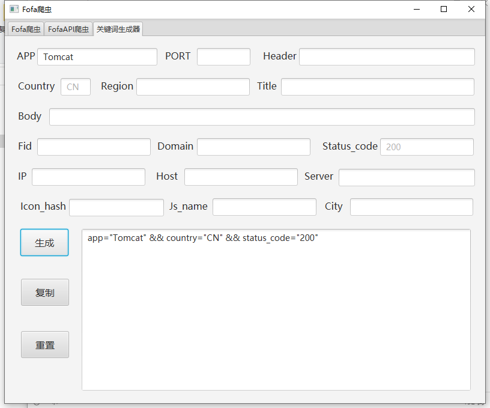

## 介绍

基于java实现的fofa爬虫。有常规爬取和api爬取两种模式。可导出至文件或MySQL数据库。可自定义代理。

## 使用方法

### 运行

#### 源代码

请提前安装好maven，java11。并配置好环境。
使用idea导入该项目，如下。

右击**pom.xml**，点击**Maven**下的**Reimport**

加载完成后打开**src/main/java/org/manlu/tools/Cipher.java**文件，将第6行的**key**修改为任意值

运行程序。

#### exe

打开文件夹FofaSpider，双击**FofaSpider.exe**，出现如下界面即可。

### 使用

#### 关键字生成器

在各个框中按需求输入关键字。点击生成即可。

例如，要获取状态码为200的中国的Tomcat，可在APP处输入**Tomcat**，点击生成即可。

若想取消国家的限制，可在Country框中输入***** 号。状态码同理。

例如要查找任意国家任意状态码的Tomcat

#### API爬虫

使用之前请先填入fofa邮箱和APIKey。可点击保存按钮，下次运行程序可自动加载。

填入之后可点击**测试API**按钮测试API是否可用。

输入关键词后点击**开始爬取**，会开始爬取数据。并呈现在表格中。

双击表格中的数据可快速在浏览器中打开。

点击**结束爬取**可终止爬虫线程。

#### Fofa爬虫

首先输入cookie。由于fofa的反爬虫机制，cookie在一天后就会失效，因此当程序检测到时间不为同一天时会自动清空已保存的cookie。请使用前更新cookie。

输入cookie后可点击**保存**按钮保存当天cookie，点击**测试**按钮测试cookie是否可用

在输入关键字后点击开始爬取，首先会获取页数，接着弹出一个对话框，要求获取爬取至多少页。

例如，我想爬取Tomcat从1到10页的数据。

点击确定即可开始爬取。

由于网络不稳定，爬取大量数据时很可能会发生数据损耗或连接超时。当你看到当前数据量超过一分钟没有变动，则为爬取结束。

#### 导出功能

当数据表中有数据时，点击**导出数据**按钮会弹出导出数据对话框

在此处可选择需要导出的信息，数据源。

导出到文件功能可将数据导出至文件。导出到MySQL功能可将数据导出到MySQL数据库。

在导出至数据库之前请填写数据库连接信息，可点击**测试连接**按钮测试，可点击**保存**按钮保存

### 修改配置文件

第一次运行程序后，程序同目录下会自动生成一个名为**FoSpi.ini**的文件，这是该程序的配置文件。

打开编辑该文件，可看到以下内容。

在此处可修改超时时间，等待时间，单页数量，并可设置代理。

参数介绍：

- timeout : 超时时间。超时时间越短，越容易出错。
- timewait : 每爬取一页后的等待时间。防止封ip。
- pagenum : 单页数据。填入10或20。建议值为20，这样会加快效率
- ip : 代理服务器的ip地址
- port : 代理服务器的端口

配置文件中的值不建议修改。如要添加代理可自行修改proxy的内容
